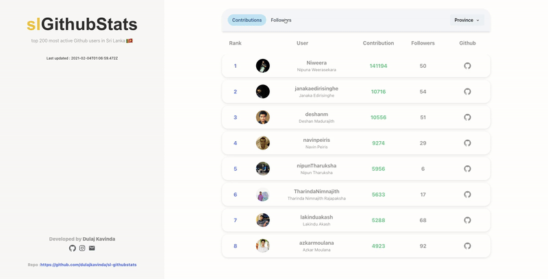

# sl-githubstats

### Description
---
**sl-githubstats** ranks top 200 most active GitHub users in Sri Lanka sorted by total contributions, followers they have and by province. Backend of this application was written in Node and deployed on Heroku.

  

### Live Demo

---

[Live Demo at Vercel](https://slgithubstats.vercel.app/)

### Why

---

I'm learning NextJS, this is one of my practice projects.

### Installation

---

To get started, just clone the repository and run `npm install && npm run dev`:

    git clone https://github.com/iaincollins/nextjs-starter.git
    npm install
    npm run dev

### Contributing

---

Got ideas on how to make this better? Open an issue [here!](https://github.com/dulajkavinda/sl-githubstats/issues)
Issues, Pull Requests and all Comments are welcome!

## License

MIT © [dulajkavinda](https://github.com/dulajkavinda/sl-githubstats/blob/master/LICENSE)
